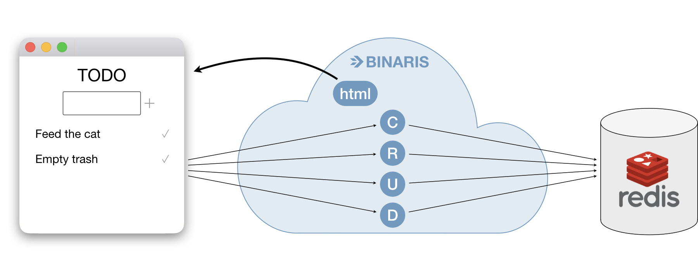

# Full Stack Tutorial
## Build a Todo App with Serverless & React

Usually, React tutorials focus on getting a frontend running on your local machine. This React tutorial leverages serverless to build a complete todo list app. By the end, we will have built both a frontend and a backend, running in a scalable production-ready cloud environment. No credit card required.

Learn more about serverless [here](https://blog.binaris.com/from-servers-to-serverless/). Learn more about Binaris [here](https://binaris.com/).

## Steps

You can **fast forward** and start at any step. Each step contains the necessary code and instructions to catch up with previous steps.

  1. [Develop a Frontend on Your Local Machine](./tutorial_sections/develop_frontend.md) <b> :clock1: 30 minutes </b>

  1. [Serve the Frontend from a Function](./tutorial_sections/serve_frontend.md) <b> :clock1: 10 minutes </b>

  1. [Set Up a Redis Datastore](./tutorial_sections/setup_redis.md) <b> :clock1: 5 minutes </b>

  1. [Build a CRUD Backend with Functions](./tutorial_sections/build_a_crud.md) <b> :clock1: 30 minutes </b>

  1. [Call the Backend Functions from the React Frontend](./tutorial_sections/connect_everything.md) <b> :clock1: 10 minutes </b>


Or, follow the simple steps below and skip it all

<details><summary>Skip to "Just do it for me"</summary>

  Download [assets](https://github.com/binaris/react-serverless/archive/connect-everything.zip) and get started

  ### Setup Your Binaris Environment

  For the next section you will need a Binaris account, if you already have one skip the following four steps.

  1. Visit [signup](https://binaris.com/signup?t=8CDa36)
  1. Follow the instructions and create your new Binaris account
  1. Install the CLI via `npm`
      ```bash
      npm install binaris -g
      ```
  1. Use `bn login` to authenticate with your newly created Binaris account
  1. (Optional) visit our [getting started](https://dev.binaris.com/tutorials/nodejs/getting-started/) page to learn the basics

  ### Setup Redis

  If you already have a Redis account, you can use either a new or pre-existing Redis instance from your account. Otherwise, you have to go through the account and instance creation flow described [here](./setup_redis.md).

  ```bash
  $ export REDIS_HOST=<YOUR_REDIS_HOST> REDIS_PORT=<YOUR_REDIS_PORT> REDIS_PASSWORD=<YOUR_REDIS_PASSWORD>
  ```

  ### Setup everything

  ```bash
  $ cd backend
  $ npm install
  $ npm run deploy
  $ cd ../frontend
  ```

  Add a "homepage" so that React routing uses your account specific function URL. Make sure to replace `<ACCOUNT_ID>` with your specific Binaris account ID. Assuming you successfully ran `bn login`, your account ID can be found in `~/.binaris.yml`.

  > Note: Your Account ID will always be a unique number, 10 digits in length.


  ```diff
  > frontend/package.json
  ---
   "private": true,
  -"homepage": "https://run.binaris.com/v2/run/<ACCOUNT_ID>/public_serve_todo",
  +"homepage": "https://run.binaris.com/v2/run/1234******/public_serve_todo",
   "dependencies": {
  ```

  Export the root endpoint environment variable (using your personal `ACCOUNT_ID`)

  ```bash
  $ export REACT_APP_BINARIS_ROOT_ENDPOINT="https://run.binaris.com/v2/run/1234******/"
  $ cd serve_todo
  $ npm install
  $ cd ../
  $ npm install && npm run build && npm run deploy
  ```

  Navigate to the URL provided in the output dialog to view your app.


</details>


## Architecture

Our app has four parts:
1. React frontend running in the browser
1. A serverless function serving the frontend
1. Serverless CRUD backend running on Binaris
1. Data stored in Redis



## Dependencies

* NodeJS
* npm
