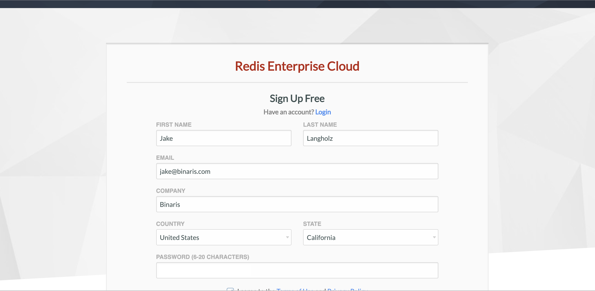
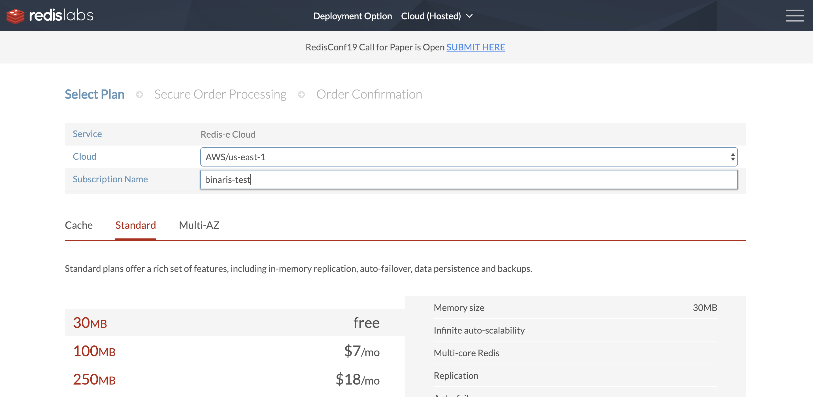
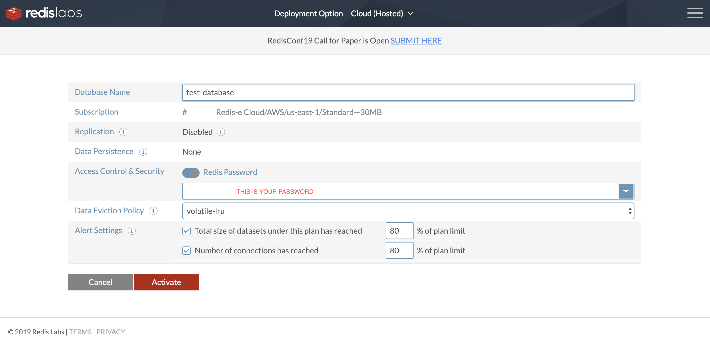
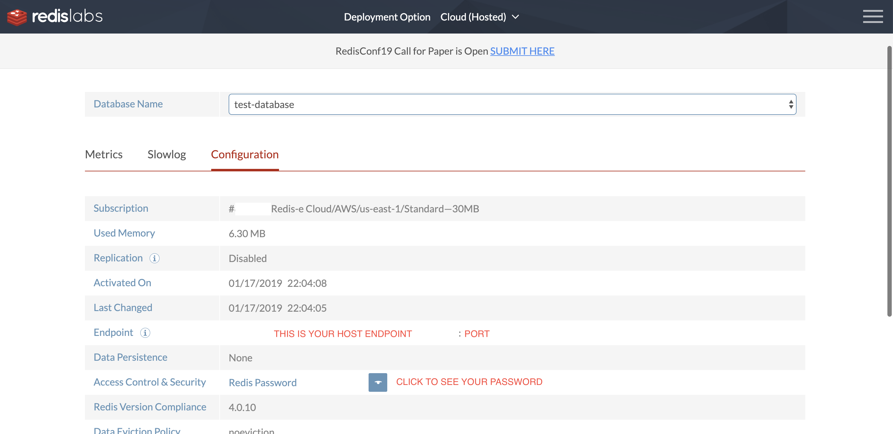

## Setup a Redis Data Store

[Serve the Frontend from a Function](./serve_frontend.md)


<details><summary>Skip to "Set Up a Redis Datastore"</summary>

  Download [assets](https://github.com/binaris/react-serverless/archive/serve-a-frontend.zip) and get started

  ### Setup Your Binaris Environment

  For the next section you will need a Binaris account, if you already have one skip the following four steps.

  1. Visit https://binaris.com/try
  1. Follow the instructions and create your new Binaris account
  1. Install the CLI via `npm`
      ```bash
      npm install binaris -g
      ```
  1. Use `bn login` to authenticate with your newly created Binaris account
  1. (Optional) visit our [getting started](https://dev.binaris.com/tutorials/nodejs/getting-started/) page to learn the basics

  ### Setup the Frontend

  ```bash
  $ cd frontend
  ```

  Add a "homepage" so that React routing uses your account specific function URL. Make sure to replace `<ACCOUNT_ID>` with your specific Binaris account ID. Assuming you successfully ran `bn login`, your account ID can be found in `~/.binaris.yml`.

  > Note: Your account ID will always be a unique number, 10 digits in length.

  ```diff
  > frontend/package.json
  ---
   "private": true,
  -"homepage": "https://run.binaris.com/v2/run/<ACCOUNT_ID>/public_serve_todo",
  +"homepage": "https://run.binaris.com/v2/run/23232*****/public_serve_todo",
   "dependencies": {
  ```

  And then run the following commands

  ```bash
  $ npm install
  $ cd serve_todo
  $ npm install
  ```

  ### To verify that you've successfully caught up...

  ```bash
  $ cd ../
  $ npm run build && npm run deploy
  ```


</details>

## Table of Contents

1. [Create Your Redis Account](#create-redis-account)  
1. [Create Your Redis Instance](#create-redis-instance)

First thing we need to do, before writing the backend functions, is get a datastore for them to utilize. For this tutorial, we will be using Redis, since it's fast, easy to set up, and doesn't require a payment method for the free tier.

<a name="create-redis-account"></a>

### Create Redis Account

Let's start by creating a Redis account. You can sign up for the service for free [here](https://app.redislabs.com/#/sign-up/cloud). This will require you to provide a first and last name, email, a name for your database (anything goes), your country of residence, and a password.



After submitting, you will be asked to verify your email address. You will then be directed to [choose a plan](https://app.redislabs.com/#/subscription/new/plan). This will involve you selecting a `Cloud`, picking a subscription name (whatever you like), and selecting your usage tier (to use it for free, select Standard/30MB). 



> Note: We recommend using AWS/us-east-1 as the Redis Cloud provider.

After completing this step, you will be directed to setup an instance.

<a name="create-redis-instance"></a>

### Create a Redis Instance

Now that we have a plan, you'll be directed to create an instance. Here, you need to enter a name for your database, preferably something relevant. Then you will want to hit the <span style="color:blue">BLUE</span> button at the end of the password line. Copy this password somewhere safe, we will need it later.



Click activate and your instance will be created, and you will be redirected to an information page about your instance. If the `Endpoint` field is not already populated, wait a few seconds and refresh the page. Once you see this field non-empty, copy this endpoint, which we will call your redis host, up until, but not including the `:<PORT_NUMBER>` at the end, and then copy the port number at the end of it.



<a name="build-backend-functions"></a>

[Build a CRUD Backend with Functions >](./build_a_crud.md)
